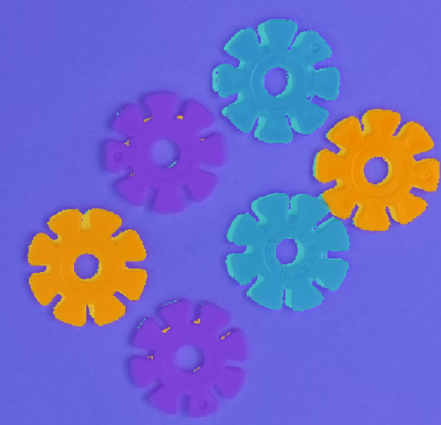
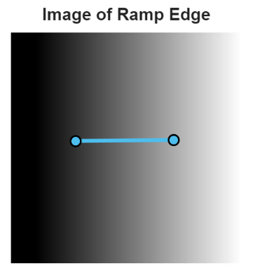
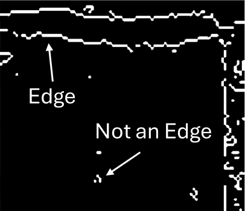
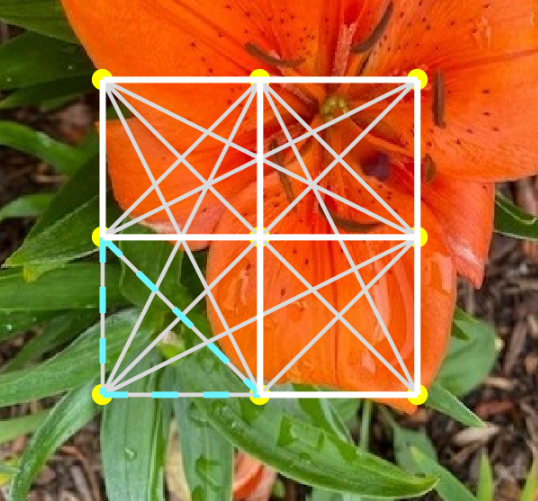
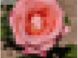
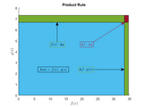

# Computer Vision Basics

 or 

**Curriculum Module**

_Created with R2025a. Compatible with R2025a and later releases._

# Information

This curriculum module contains interactive [MATLAB® live scripts](https://www.mathworks.com/products/matlab/live-editor.html) centered on the fundamentals of image segmentation.

## Background

You can use these live scripts as demonstrations in lectures, class activities, or interactive assignments outside class. This module covers image segmentation techniques, covering edge detection, region\-based and clustering methods, the integration of texture and color, optical flow algorithms, and practical application scenarios to enhance segmentation accuracy and effectiveness. It also includes examples.

The instructions inside the live scripts will guide you through the exercises and activities. Get started with each live script by running it one section at a time. To stop running the script or a section midway (for example, when an animation is in progress), use the  Stop button in the **RUN** section of the **Live Editor** tab in the MATLAB Toolstrip.

## Contact Us

Solutions are available upon instructor request. Contact the [MathWorks teaching resources team](mailto:onlineteaching@mathworks.com) if you would like to request solutions, provide feedback, or if you have a question.

## Prerequisites

This module assumes knowledge of first year calculus, linear algebra. There is minimal MATLAB knowledge required for these scripts, but you can use [MATLAB Onramp](https://matlabacademy.mathworks.com/details/matlab-onramp/gettingstarted) as a resource to acquire familiarity with live scripts and MATLAB syntax.

## Getting Started
### Accessing the Module
### **On MATLAB Online:**

Use the  link to download the module. You will be prompted to log in or create a MathWorks account. The project will be loaded, and you will see an app with several navigation options to get you started.

### **On Desktop:**

Download or clone this repository. Open MATLAB, navigate to the folder containing these scripts and double\-click on [ComputerVisionBasics.prj](<matlab: openProject("ComputerVisionBasics.prj")>). It will add the appropriate files to your MATLAB path and open an app that asks you where you would like to start. 

Ensure you have all the required products ([listed below](#H_E850B4FF)) installed. If you need to include a product, add it using the Add\-On Explorer. To install an add\-on, go to the **Home** tab and select   **Add-Ons** > **Get Add-Ons**. 

## Products

MATLAB® is used throughout. Tools from the Image Processing Toolbox™, Computer Vision Toolbox™, and Statistics and Machine Learning Toolbox™ are used frequently as well.

# Scripts
## **IntrotoImageSegmentation.mlx (planned)**
||||
| :-: | :-- | :-- |
|     | **In this script, students will...**   $\bullet$ Examine three image segmentation methods.    $\bullet$ Work through step\-by\-step examples of applying image segmentation.   $\bullet$ Distinguish appropriate image segmentation technique based on scenario.    | **Academic disciplines**   $\bullet$ Robotics   $\bullet$ Computer Vision   $\bullet$ Image Processing     |

## [**EdgeDetectionTheory.mlx**](https://matlab.mathworks.com/open/github/v1?repo=MathWorks-Teaching-Resources/Computer-Vision-Basics&project=ComputerVisionBasics.prj&file=Scripts/EdgeDetectionTheory.mlx)
||||
| :-- | :-- | :-- |
|     | **In this script, students will...**   $\bullet$ Identify and describe the characteristics and sources of edges.   $\bullet$ Characterize edges in 1D and 2D.   $\bullet$ Detect edges amid noise.    | **Academic disciplines**   $\bullet$ Computer Vision   $\bullet$ Image Processing   $\bullet$ Medical Imaging                   |

## [**EdgeDetectionApplied.mlx**](https://matlab.mathworks.com/open/github/v1?repo=MathWorks-Teaching-Resources/Computer-Vision-Basics&project=ComputerVisionBasics.prj&file=Scripts/EdgeDetectionApplied.mlx) 
||||
| :-- | :-- | :-- |
|     | **In this script, students will...**   $\bullet$ Evaluate edge detection methods.   $\bullet$ Apply edge detection techniques.    | **Academic disciplines**   $\bullet$ Computer Vision   $\bullet$ Image Processing                   |

## **RegionSegmentation.mlx (planned)**
||||
| :-: | :-- | :-- |
|     | **In this script, students will...**   $\bullet$ Explore region segmentation techniques.   $\bullet$ Compare and contrast including histogram, k\-means clustering, and graph\-cut segmentation techniques.     | **Academic disciplines**   $\bullet$ Computer Vision   $\bullet$ Image Processing     |

## **OpticalFlow.mlx (planned)**
||||
| :-: | :-- | :-- |
|     | **In this script, students will...**   $\bullet$ Explore use cases for optical flow for image segmentation.   $\bullet$ Implement optical flow algorithms for motion detection including Lucas\-Kanade, Horn\-Schunk, and Lucas\-Kanade Derivative of Gaussian methods.   $\bullet$ Compare and contrast optical flow techniques.    | **Academic disciplines**   $\bullet$ Computer Vision   $\bullet$ Image Processing     |

# License

The license for this module is available in the [LICENSE.md](https://github.com/MathWorks-Teaching-Resources/Computer-Vision-Basics/blob/release/LICENSE.md).

# Related Courseware Modules

## [Convolution in Digital Image Processing](https://www.mathworks.com/matlabcentral/fileexchange/97112-convolution-in-digital-signal-processing)
|||
| :-- | :-- |
|     | **Available on:**           [GitHub](https://github.com/https://github.com/MathWorks-Teaching-Resources/Convolution-Digital-Signal-Processing)     |

## [Calculus Derivatives](https://www.mathworks.com/matlabcentral/fileexchange/99249-calculus-derivatives?s_tid=srchtitle)
|||
| :-- | :-- |
|     | **Available on:**           [GitHub](https://github.comhttps//github.com/MathWorks-Teaching-Resources/Calculus-Derivatives)     |

## [Machine Learning Methods: Clustering](https://www.mathworks.com/matlabcentral/fileexchange/135381-machine-learning-methods-clustering)
|||
| :-- | :-- |
|     | **Available on:**           [GitHub](https://github.com/MathWorks-Teaching-Resources/Machine-Learning-Methods-Clustering)     |

Or feel free to explore our other [modular courseware content](https://www.mathworks.com/matlabcentral/fileexchange/?q=tag%3A%22courseware+module%22&sort=downloads_desc_30d).

# Educator Resources
-  [Educator Page](https://www.mathworks.com/academia/educators.html) 

# Contribute 

Looking for more? Find an issue? Have a suggestion? Please contact the [MathWorks teaching resources team](mailto:%20onlineteaching@mathworks.com). If you want to contribute directly to this project, you can find information about how to do so in the [CONTRIBUTING.md](https://github.com/MathWorks-Teaching-Resources/Computer-Vision-Image-Basics/blob/release/CONTRIBUTING.md)  page on GitHub.

 *©* Copyright 2025 The MathWorks, Inc.

